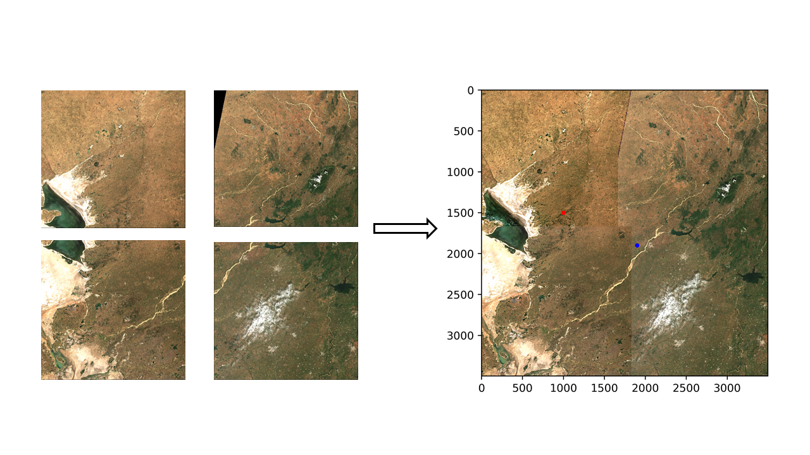
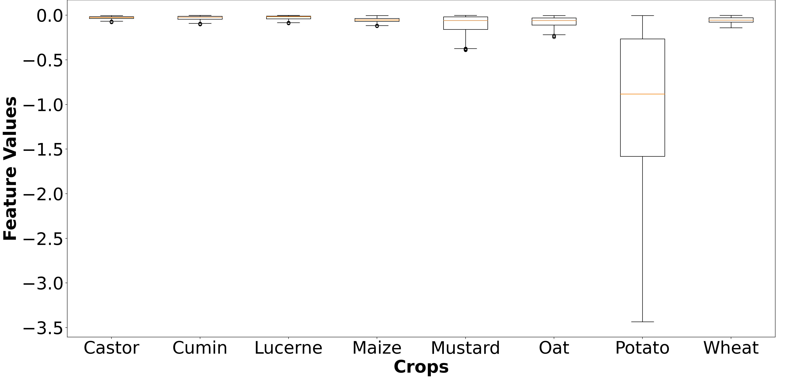

# Novel Remote Sensing Method for Automatic Potato Crop Mapping without Labels using Temporal Sentinel-2 Data

This project involves the following concepts:
Time series properties.
1. Crop distinct properties.
2. Data processing stages
    i. Data Collection
    ii. Data Preprocessing
    iii. Data Processing
    iv. Unsupervised Algorithm Formulation
3. Vegetation Indices' and Spectral Bands' sensitivity to specific crop under study (in this case, potato crop).
4. Supervised and unsupervised classification.

## Data Used:
Sentinel-2 multispectral data details are as follows:    
- 12 Bands, primarily focussed on Blue, Green, Red and NIR bands.
- Period of interest - 01/10/2023 to 15/03/2024.
- Region of interest - Banaskantha district (One of the largest potato exporting regions in the country).

## Ground Truth Collection:
The ground truth used for supervised and unsupervised processing was supplied by the Ministry of Agriculture and Farmer's Welfare. The potato crop marked polygons were used for potato pixel extraction which was further used for supervised training which finally led to unsupervised algorithm generation.

## Data Preprocessing:
- Data Mosaicking.
- Data Masking (Banaskantha District Mask + ESRI LULC (Land-Use Land Cover) Mask).
- Data Stacking (Temporal Stack).
- Generating 10 vegetation indices.

#### Data Mosaicking:
 

#### Data Masking:

## Feature Engineering:
A Vegetation Index (VI) is a transformation of two or more spectral imagery bands that highlight vegetation present in the image, thereby supplementing remote sensing. Firstly, the following VIs were selected:
- EVI2 (Enhanced Vegetation Index 2)
- GNDVI (Green Normalised Difference Vegetation Index)
- MSAVIhyper (Modified Soil Adjusted Vegetation Index hyper)
- MTVI1 (Modified Triangular Vegetation Index 1)
- NDMI (Normalized Difference Moisture Index)
- OSAVI (Optimized Soil Adjusted Vegetation Index)
- NDVI (Normalised Difference Vegetation Index)
- PSRI (Plant Senescence Reflectance Index)
- SAVI3 (Soil Adjusted Vegetation Index 3)
- VARIGreen (Visible Atmospherically Resistant Index - Green)

### Two filters are used for selecting VIs given as follows:
### Filter - 1:
The difference time series plots for various crops will help select which indices best show the difference between potatoes and another crop. Thereby showing its sensitivity to potato crops.
The plots are shown as follows:
.png>) 
.png>) 
.png>)

### Filter - 2:
The difference between potato crop pixels and the average of other crop pixels throughout the period of interest will show the sensitivity of a vegetation index with respect to potato crops, especially during harvesting.
The bar plots are shown as follows:

Therefore, MTVI1 and MSAVIhyper were used for algorithm creation.

## Processing:
### Processing Resources Used:
The processing environment allotted for this project by the SRTD at SAC comprises the
following specifications:
- CPU: Intel Xeon CPU E5-2640 v4, clocking at 2.4GHz, 56 virtual cores.
- GPU: Nvidia Quadro M2000, shared GPU memory: 128 GB.
- Secondary Storage: 4 TB HDD.
- Primary Storage: 256 GB DDR5 RAM.
- Internet Facilities: Single thin client provided per laboratory of student interns.

### Supervised Processing:
The ground truth collected for potato crop was used to train two ML models namely XGBoost and Random Forest on MTVI1 and MSAVIhyper. Since the data was huge in size, the prediction time was over 180 hours while utilising a single core of CPU and it was 23 hours while utilising 85% of the CPU resources.

### Unsupervised Processing:
Over multiple iterations with MTVI1 and MSAVIhyper VIs and NIR and Green Bands, the following algorithm is proposed for unsupervised segmentation of multispectral data for potato crop detection:

### Potato Feature Calculation

Potato Feature =  
\[
\frac{\left(\frac{1}{N} \sum_{t=0}^{N} (MTVI1_{t+1} - MTVI1_{t}) \times MTVI1_{\text{peak greenness}}\right)}{MTVI1_{\text{harvesting}} \times MSAVI_{\text{peak greenness}}}
\]

Where:
- `MTVI1` stands for Modified Triangular Vegetation Index
- `MSAVI` stands for Modified Soil-Adjusted Vegetation Index
- N is the total number of dates/period of interval taken under study

And thus the potato feature generated was to be thresholded to generate the final segmented image. Segmentation of generated potato feature with the following threshold giving maximum accuracy of 84.48 % and Potato feature < -0.2078.

The segmented output of the proposed algorithm and the potato feature values for various crops is given below:
 

The proposed algorithm takes 30 minutes to generate and display segmented output on a single core of multi-core processing system while the supervised algorithm takes 23 hours to generate segmented output while multi-core processing.

This repository acts a submission for Major Project while pursuing B.Tech CSE at Nirma University and interning at EPSA Divison, Space Applications Centre, ISRO, Ahmedabad, India.
Internal Guide: Dr. Tarjni Vyas.
External/Industry Guide: Shri. Mukesh Kumar.